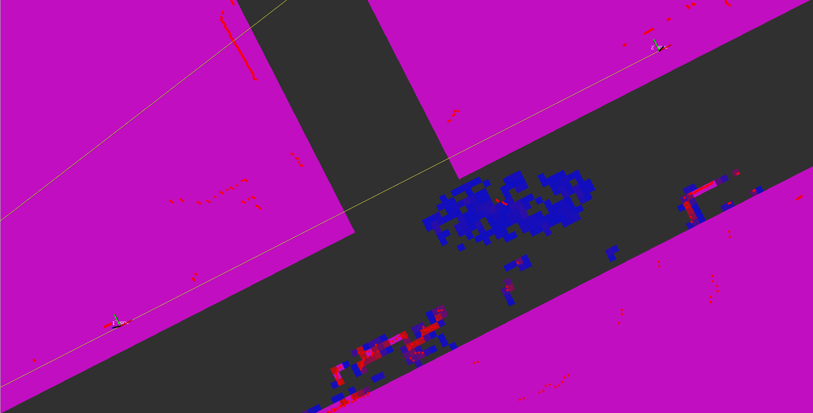

# Heatmap generator
This package creates costmaps from 2D laser scans. This package is tested with upto 10 laser scanners.


## Usage
```
roslaunch heatmap_gen heatmap_generator.launch
```
## Main Repo
[RAMP-EU: Heat map generator](https://github.com/ramp-eu/THMHO_heatmap_generator.git)